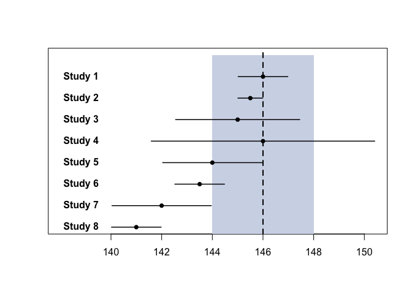
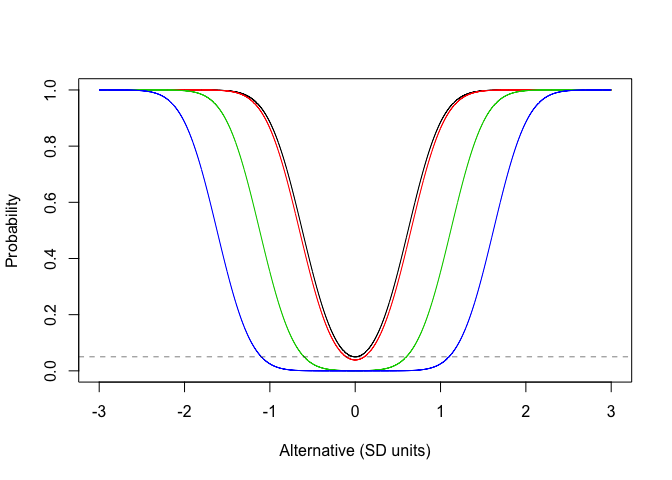
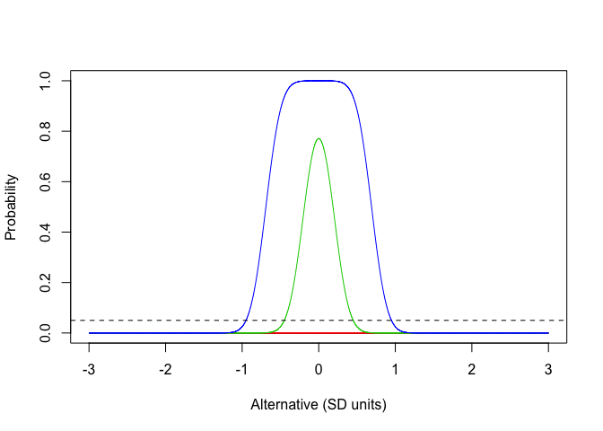
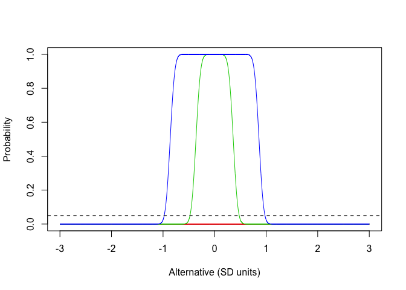
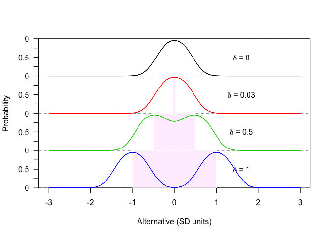
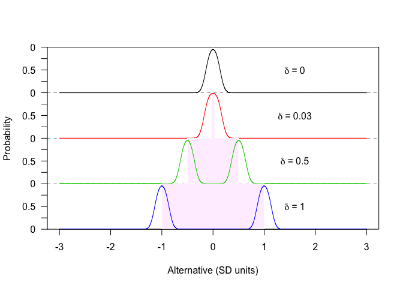

<!-- README.md is generated from README.Rmd. Please edit that file -->
sgpvalue
========

The goal of sgpvalue is to help bring clarity to the Second Generation P-value paper.

Installation
------------

``` r
# install.packages("devtools")
devtools::install_github("LucyMcGowan/sgpvalue")
```

Example
-------

The `p_delta()` function will calculate the Second Generation P-value give the 95% interval (`lb`, `ub`) and indifference zone (`delta_lb`, `delta_ub`).

``` r
library(sgpvalue)
p_delta(lb = 145, ub = 148, delta_lb = 147, delta_ub = 149)
#> [1] 0.3333333
```

### Comparison to traditional methods

The `compare_p()` function allows the user to compare Traditional Maximum p-values, and Second Generation P-values for given studies. For example, below are mock results from 8 studies of systolic blood pressure. Here the point null is 146 mmHg, indicated by the vertical dashed line, with an indifference zone, or interval null hypothesis, from 144 mmHg to 148 mmHg shaded in blue-grey (Figure 2 from the Second Generation P-value paper).

``` r
data <- data.frame(
   xbar = c(146, 145.5, 145, 146, 144, 143.5, 142, 141),
   se = c(0.5, 0.25, 1.25, 2.25, 1, 0.5, 1, 0.5)
   )
compare_p(data, delta_lb = 144, delta_ub = 148, h0 = 146)
```



    #>    xbar   se     lb     ub   p_old   p_max     p_new
    #> 1 146.0 0.50 145.02 146.98 1.00000 1.00000 1.0000000
    #> 2 145.5 0.25 145.01 145.99 0.04550 1.00000 1.0000000
    #> 3 145.0 1.25 142.55 147.45 0.42371 1.00000 0.7040816
    #> 4 146.0 2.25 141.59 150.41 1.00000 1.00000 0.5000000
    #> 5 144.0 1.00 142.04 145.96 0.04550 1.00000 0.5000000
    #> 6 143.5 0.50 142.52 144.48 0.00000 0.31731 0.2448980
    #> 7 142.0 1.00 140.04 143.96 0.00006 0.04550 0.0000000
    #> 8 141.0 0.50 140.02 141.98 0.00000 0.00000 0.0000000

### Operating characteristics

You can observe the operating characteristics using the `power_curves()` function. This allows you to input `n` and varying `delta` values and observe power curves for the `null`, `alternative`, or `inconclusive` p\_delta values.

Figure S3 from the second generation P-value paper. The relationship between the probability that p\_delta = 0 varying delta.

``` r
power_curves(delta = c(0, 1/30, 1/2, 1), n = 10, prob = "null")
```



Figure S5 from the second generation P-value paper. The relationship between probability of data supported compatibility 517 with the null hypothesis, and various deltas.

``` r
## n = 40 (Figure S5 left)
power_curves(delta = c(0, 1/30, 1/2, 1), n = 40, prob = "alternative")
```



``` r
## n = 200 (Figure S5 right)
power_curves(delta = c(0, 1/30, 1/2, 1), n = 200, prob = "alternative")
```



Figure S6 from the second generation P-value paper. The relationship between the probability of an inconclusive result and various deltas.

``` r
## n = 20 (Figure S6 left)
power_curves(delta = c(0, 1/30, 1/2, 1), n = 20, prob = "inconclusive")
```



``` r
## n = 200 (Figure S6 right)
power_curves(delta = c(0, 1/30, 1/2, 1), n = 200, prob = "inconclusive")
```


